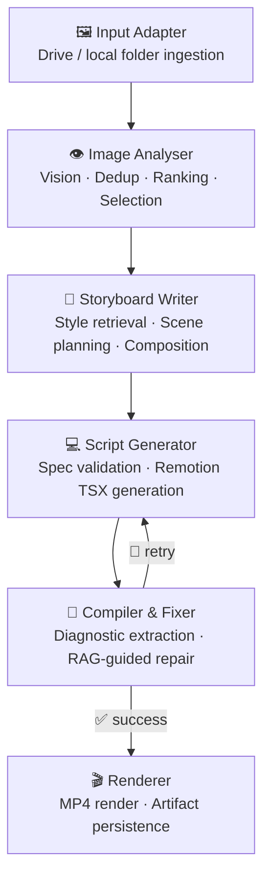

# 🎬 FotoOwl ReelGraph

> **An AI-powered, multi-agent pipeline that transforms event photos into a cinematic video reel — from a single Drive link and a creative prompt.**


---

## ✨ Overview

**FotoOwl ReelGraph** is a five-node agentic pipeline built with **LangGraph** that takes a Google Drive folder of event photos and a natural-language creative brief, then produces:

- A **structured storyboard** with scene-by-scene composition plans
- A **Remotion TSX composition** generated and auto-repaired by a code-capable LLM
- A **rendered MP4 slideshow reel** saved locally with full trace artifacts
- A **Streamlit UI** for zero-friction, point-and-click reel generation

The system supports both **OpenAI** and **Google Gemini** as LLM backends, with a deterministic offline fallback for testing.

---

## 🏗️ Architecture



### Agent Responsibilities

| Agent | What it does |
|---|---|
| **Input Adapter** | Ingests a public Google Drive folder or local path; samples video keyframes |
| **Image Analyser** | Runs batch vision analysis, scores for quality & diversity, clusters events, selects top images |
| **Storyboard Writer** | Retrieves style guides from Chroma, writes a scene-by-scene storyboard, plans composition spec |
| **Script Generator** | Validates the composition spec, retrieves Remotion component docs, generates type-safe TSX |
| **Compiler & Fixer** | Compiles the TSX, extracts diagnostics, retrieves targeted fix docs, patches and recompiles |
| **Renderer** | Assembles the final MP4 from the composition spec and saves all run artifacts |

---

## 🚀 Quick Start

### 1. Clone & Install

```bash
git clone https://github.com/ParshvaDongare/Footowl_videoAi.git
cd Footowl_videoAi
pip install -e .
```

### 2. Configure Environment

```bash
cp .env.example .env
```

Open `.env` and set your API key:

```env
# Choose your LLM provider
LLM_PROVIDER=gemini          # or: openai

GEMINI_API_KEY=your_key_here
# OPENAI_API_KEY=your_key_here
```

> ℹ️ If no API key is set, the pipeline falls back to deterministic heuristics — useful for offline testing.

### 3. Run

**Streamlit UI (recommended)**
```bash
python -m streamlit run ui/streamlit_app.py
```

**Command-line**
```bash
# From a local folder
python -m app.main --source path/to/images --prompt "Cinematic wedding reel, slow and emotional, warm tones"

# From a public Google Drive folder
python -m app.main \
  --source "https://drive.google.com/drive/folders/<folder_id>" \
  --prompt "Upbeat birthday reel, fast cuts, bold captions, energetic"
```

**Run tests**
```bash
python -m unittest discover -s tests -v
```

---

## 🖥️ Streamlit UI

The web UI provides a full creative control panel:

| Control | Options |
|---|---|
| **Aspect ratio** | 9:16 · 16:9 · 1:1 |
| **Target duration** | 8 – 60 seconds |
| **Video style** | Cinematic · Vlog · Promotional · Aesthetic · Wedding · Birthday · Corporate |
| **Transitions** | Auto · Fade · Soft fade · Quick cuts · Slide |
| **Animations** | Auto · Subtle pan · Slow zoom · Zoom in · Dynamic |
| **Text overlays** | Enabled / Disabled |
| **Background music** | Auto · No music · Uplifting · Ambient · Cinematic · Energetic |
| **Voice-over** | Auto · Narration · Dramatic · Friendly |

Paste a public Google Drive link, write your prompt, and hit **Generate video**. The UI streams the pipeline output and lets you download the final MP4.

---

## 📁 Project Structure

```
Footowl_videoAi/
├── app/
│   ├── agents/
│   │   └── nodes.py              # Five pipeline node implementations
│   ├── graph/
│   │   └── pipeline.py           # LangGraph execution graph
│   ├── services/
│   │   ├── ai_service.py         # LLM orchestration (OpenAI / Gemini)
│   │   ├── vision_service.py     # Batch image analysis & scoring
│   │   ├── retrieval_service.py  # ChromaDB RAG retrieval
│   │   ├── compiler_service.py   # TSX compile & diagnostic extraction
│   │   ├── rendering_service.py  # MP4 assembly
│   │   ├── embedding_service.py  # Embedding model wrapper
│   │   ├── llm_service.py        # LLM provider abstraction
│   │   ├── input_adapter.py      # Drive / local ingestion
│   │   └── drive_service.py      # Google Drive API integration
│   ├── prompts/
│   │   ├── script.md             # Code generation prompt template
│   │   ├── vision.md             # Vision analysis prompt template
│   │   └── judge.md              # Coherence judge prompt template
│   ├── rag/                      # Retrieval seed data
│   ├── models.py                 # Typed shared state & artifacts (Pydantic)
│   ├── settings.py               # Environment-based configuration
│   └── main.py                   # CLI entrypoint
├── ui/
│   └── streamlit_app.py          # Streamlit web interface
├── tests/                        # Offline-safe mocked test suite
├── sample_input/                 # Example input images
├── sample_output/                # Example pipeline output artifacts
├── .env.example                  # Configuration template
└── pyproject.toml                # Project metadata & dependencies
```

---

## 🧠 State Design

The pipeline carries a single typed `PipelineState` object through all nodes:

```
Input       →  run_id · source_type · source_ref · user_prompt · images
Intermediate → current_node · video_intent · image_analysis · selected_images
               retrieval_context · storyboard · composition_spec
               validation_result · remotion_code · compile_errors · retry_count
Output      →  status · output_video · artifact_paths
```

---

## 🗄️ Run Artifacts

Every run saves a complete audit trail under `output/<run_id>/`:

| File | Contents |
|---|---|
| `storyboard.json` | Scene-by-scene creative plan |
| `composition_spec.json` | Typed composition parameters |
| `Composition.tsx` | Generated Remotion component |
| `compile_attempts.json` | Full compile/fix loop history |
| `pipeline_state.json` | Final pipeline state snapshot |
| `graph_trace.json` | Per-node latency & I/O trace |
| `output.mp4` | The rendered video reel |

---

## ⚙️ Configuration Reference

All settings are overridable via environment variables (see `.env.example`):

| Variable | Default | Description |
|---|---|---|
| `LLM_PROVIDER` | `gemini` | `gemini` or `openai` |
| `GEMINI_API_KEY` | — | Gemini API key |
| `OPENAI_API_KEY` | — | OpenAI API key |
| `GEMINI_CALL_BUDGET` | `6` | Max Gemini API calls per run |
| `RETRY_LIMIT` | `3` | Max compile/fix retry attempts |
| `TOP_K_RETRIEVAL` | `3` | Documents retrieved per RAG query |
| `MAX_SELECTED_IMAGES` | `6` | Images passed to the storyboard stage |
| `MAX_STORYBOARD_SCENES` | `6` | Max scenes in the generated storyboard |
| `CHROMA_PATH` | `chroma_store_runtime` | ChromaDB persistence path |
| `LLM_CACHE_PATH` | `llm_cache` | Gemini response cache path |

---

## 🔍 Retrieval Design (RAG)

ChromaDB collections used at runtime:

| Collection | Purpose |
|---|---|
| `style_guides` | One compact style card per visual style; used by the Storyboard Writer |
| `remotion_components` | Remotion component API docs; used during code generation |
| `remotion_animation` | Animation API reference; used during generation & repair |
| `remotion_transition` | Transition API reference; used during generation & repair |
| `remotion_cli` | CLI flags and error patterns; used during the compile/fix loop |

---

## 🧪 Testing

Tests are **fully offline** — they use synthetic images and mocked LLM/compiler behavior, so no API key is needed to run them.

```bash
python -m unittest discover -s tests -v
```

Scenarios covered:
- Different prompts on the same image set
- Artifact generation and persistence
- Judge / coherence validation
- Compile/fix retry loop

---

## ⚠️ Known Limitations

- **Google Drive ingestion** is best-effort and requires the folder to be set to "Anyone with the link can view".
- **Video files** in Drive folders are sampled into keyframes before analysis (the core pipeline is image-first).
- **The renderer** produces a functional local MP4 slideshow rather than a full Remotion/browser render.
- **Chroma storage** is recreated per run to keep the test suite deterministic.

---

## 🤔 Why This Architecture?

- **Five-agent shape** matches the assignment exactly, with no hidden shortcuts.
- **Planning is separated from code generation** — the Storyboard Writer produces human-readable intent before the Script Generator touches TypeScript.
- **Retries are diagnostic-driven** — the Compiler & Fixer uses RAG to find targeted fixes rather than blindly regenerating.
- **Every run is fully auditable** — all intermediate artifacts and latency traces are saved to disk.
- **Offline-safe** — deterministic fallbacks mean the full pipeline can be demoed without spending API credits.

---

## 🛠️ Tech Stack

| Layer | Technology |
|---|---|
| Orchestration | [LangGraph](https://github.com/langchain-ai/langgraph) |
| LLM Backends | Google Gemini · OpenAI GPT-4o |
| Vector Store | [ChromaDB](https://www.trychroma.com/) |
| Vision | Gemini Vision · PIL / OpenCV |
| UI | [Streamlit](https://streamlit.io/) |
| Data Models | [Pydantic v2](https://docs.pydantic.dev/) |
| Video Output | OpenCV (MP4) |
| Testing | Python `unittest` (offline, mocked) |
