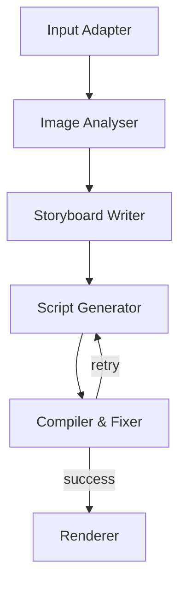

# FotoOwl ReelGraph

Local implementation of the FotoOwl take-home: a five-node, typed pipeline that turns event photos plus a creative brief into a rendered reel and full trace artifacts.

## What It Does
- Parses the brief into structured intent.
- Analyses photos, ranks them, suppresses near-duplicates, and selects a diverse subset.
- Writes a storyboard and composition plan with retrieval-backed style context.
- Generates a Remotion TSX composition from a validated structured spec.
- Runs a diagnostic-driven compile/fix loop.
- Renders an MP4 slideshow reel locally and saves all intermediate artifacts.

## Run
```bash
python -m unittest discover -s tests -v
python -m app.main --source path\\to\\images --prompt "Cinematic wedding reel, slow and emotional, warm tones, minimal text"
python -m app.main --source "https://drive.google.com/drive/folders/<folder_id>" --prompt "Upbeat birthday reel, fast cuts, bold captions, energetic"
```

## Project Layout
- `app/agents/` - pipeline node implementations
- `app/graph/` - five-node execution graph
- `app/models.py` - typed shared state and artifacts
- `app/services/` - AI, retrieval, compiler, rendering, logging, input, artifact services
- `app/rag/` - retrieval seed data
- `app/prompts/` - version-controlled prompt templates
- `tests/` - mocked, offline-safe validation

## Graph


## Internal Sub-steps
- `Image Analyser`: vision analysis, duplicate detection, ranking, diversification, selection.
- `Storyboard Writer`: style retrieval, storyboard creation, composition planning.
- `Script Generator`: schema validation, structured code generation, formatting.
- `Compiler & Fixer`: diagnostic extraction, retrieval, fix planning, patch proposal, recompilation.

## State Design
- `Input`: `run_id`, `source_type`, `source_ref`, `user_prompt`, `images`
- `Intermediate`: `current_node`, `video_intent`, `image_analysis`, `selected_images`, `retrieval_context`, `storyboard`, `composition_spec`, `validation_result`, `remotion_code`, `compile_errors`, `retry_count`
- `Output`: `status`, `output_video`, `artifact_paths`

## Model Routing
- Intent parsing: fast text model
- Image analysis: vision-capable fast model
- Storyboard writing: structured-output text model
- Script generation: stronger code-capable model
- Compile fixing: code-repair model
- Judge test: separate judge-capable model

The repo uses an offline-safe heuristic backend by default, but the service boundaries are explicit so real models can be wired in without changing the graph.

## Retrieval Design
- `style_guides` collection: one compact style card per style.
- `remotion_components`, `remotion_animation`, `remotion_transition`, `remotion_cli`: code-oriented chunks for generation and repair.
- Top-k retrieval is configurable via `TOP_K_RETRIEVAL`.

## Persistence
- The run folder contains:
  - `storyboard.json`
  - `composition_spec.json`
  - `Composition.tsx`
  - `compile_attempts.json`
  - `pipeline_state.json`
  - `graph_trace.json`
  - `output.mp4`
- A stable reviewer entrypoint is available at `sample_output/latest`.

## Configuration
- Copy `.env.example` to `.env` if you want to override defaults.
- Tunables include model names, retry count, retrieval top-k, output size, and output paths.

## Testing
- Tests are offline and use synthetic images and mocked behavior.
- Scenarios:
  - different prompts on the same image set
  - artifact generation
  - judge/coherence validation

## Known Limitations
- The offline build uses a local graph executor and local vector retrieval rather than external LangGraph/Chroma packages.
- Public Google Drive folder ingestion is best-effort and depends on the folder being publicly readable.
- The renderer is a functional local MP4 slideshow rather than a full Remotion render.

## Why This Architecture Works
- It preserves the assignment's required five-agent shape.
- It keeps creative planning separate from code generation without exposing extra graph nodes.
- It makes retries diagnostic-driven and easy to inspect in the saved trace.
- It is simple enough to demo quickly and structured enough to extend during review.
